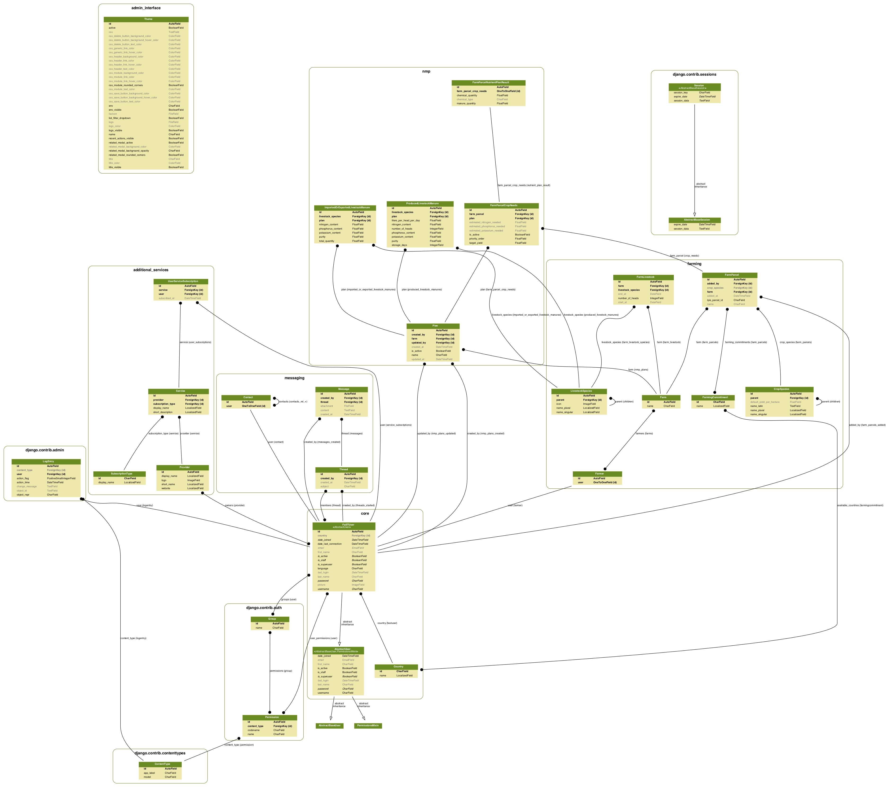
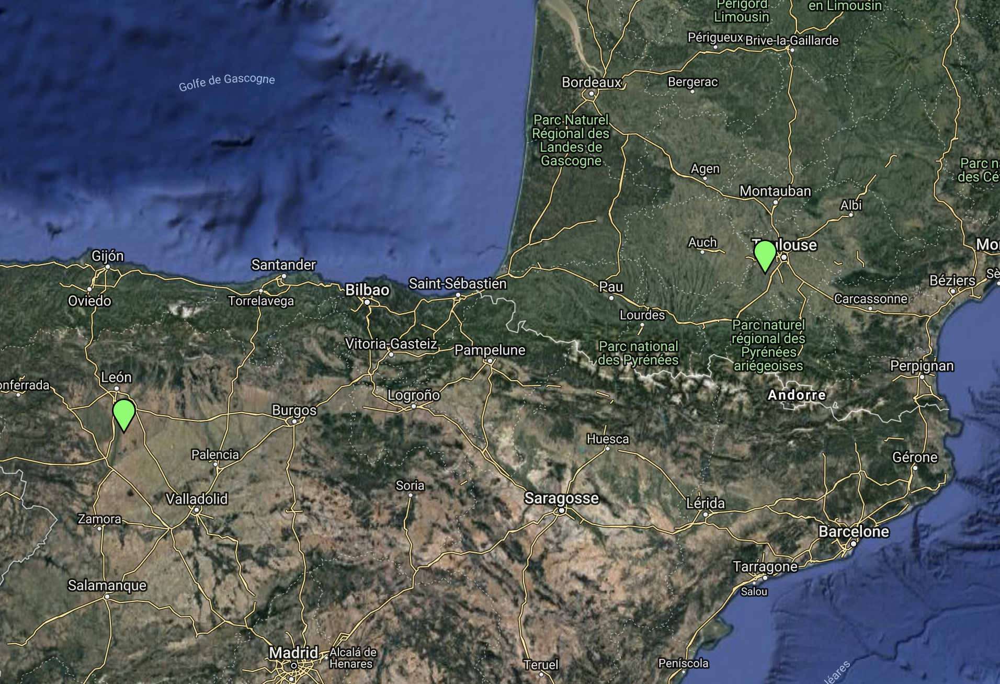
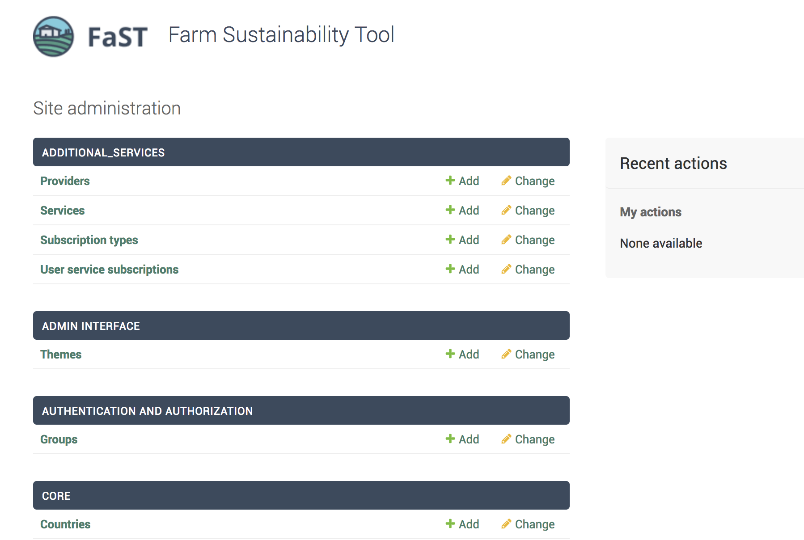
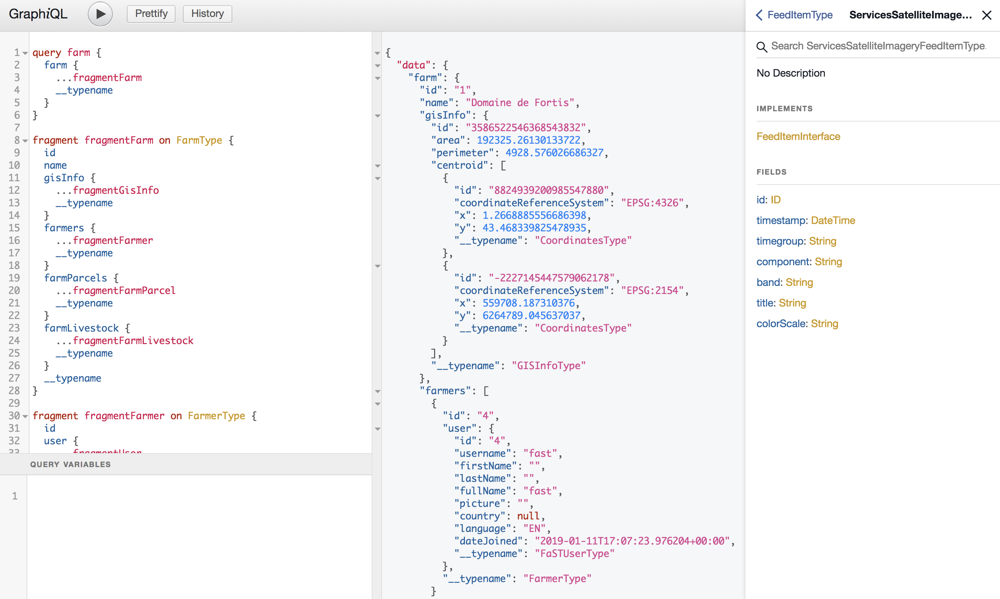
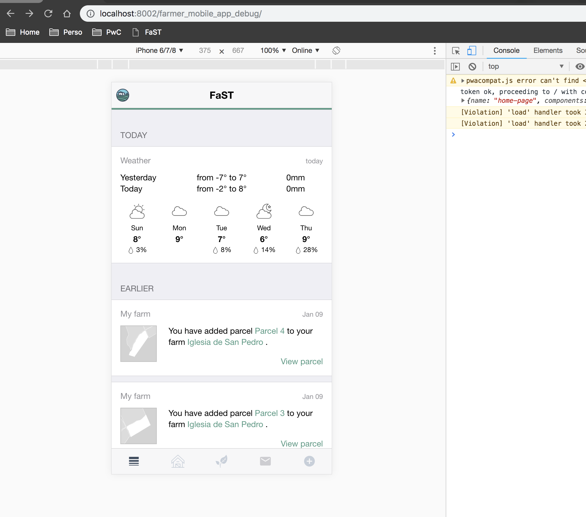

[vuejs]: https://vuejs.org/  "Vuejs"
[python]: https://python.org/  "Python"
[apollo]: https://www.apollographql.com/ "Apollo"
[leaflet]: https://leafletjs.com/ "Leaflet"
[framework7]: https://framework7.io/ "Framework7"
[django]: https://www.djangoproject.com/ "Django"
[graphql]: https://graphql.org/ "GraphQL"
[graphene]: https://graphene-python.org/ "Graphene"
[nuclio]: https://nuclio.io/ "Nuclio"
[docker]: https://www.docker.com/ "Docker"
[kubernetes]: https://kubernetes.io/ "Kubernetes"
[kafka]: https://kafka.apache.org/ "Kafka"
[mongodb]: https://www.mongodb.com/ "MongoDB"
[postgres]: https://www.postgresql.org/ "Postgres"
[nodejs]: https://www.nodejs.org/ "NodeJS"

[darksky]: https://darksky.net/ "DarkSky"
[mapquest]: https://www.mapquest.com/ "Mapquest"

<p align="center"></p>
<p align="center"></p>

<hr>

&nbsp;&nbsp;&nbsp;&nbsp;&nbsp;&nbsp;&nbsp;&nbsp;&nbsp;&nbsp;&nbsp;&nbsp;&nbsp;&nbsp;&nbsp;&nbsp;&nbsp;&nbsp;&nbsp;&nbsp;&nbsp;&nbsp;&nbsp;&nbsp;&nbsp;&nbsp;&nbsp;&nbsp;&nbsp;&nbsp;&nbsp;&nbsp;&nbsp;&nbsp;&nbsp;&nbsp;&nbsp;&nbsp;&nbsp;&nbsp;&nbsp;&nbsp;&nbsp;&nbsp;&nbsp;&nbsp;&nbsp;&nbsp;&nbsp;&nbsp;&nbsp;&nbsp;&nbsp;&nbsp;&nbsp;&nbsp;&nbsp;&nbsp;&nbsp;

[][python]
[][vuejs]
[](https://opensource.org/licenses/MIT)

The Farm Sustainability Tool for nutrients will be a digital tool to help individual farmers improve both the agronomic and environmental performance of their farms, by supporting them in the development of an accurate Nutrient Plan Management.

> In order to address citizens’ increasing expectations concerning food quality as well as the environment and the climate, the transition towards a fully-sustainable agricultural sector must be supported by public policies. Buy-in and environmental gains would see an improvement, since FaST will provide clear and timely information that is beneficial for farmers from both an economic and environmental perspective. Farm competitiveness and resilience is increased through enhanced decision support to farmers, who will be able to optimise their nutrient use to improve their incomes, whilst higher environmental and climate benefits are delivered through better access to relevant farm data and including environmental sustainability considerations in the overall farm management decisions.

*These repositories contains the full code base for the early prototype that was developped by PwC to demonstrate the interest and feaibility of such a platform.*

# Table of content

- [Related repositories](#related-repositories)
- [Web backend](#web-backend)
  - [Relational data model](#relational-data-model)
  - [Microservices](#microservices)
  - [External APIs](#external-apis)
  - [GraphQL schema](#graphql-schema)
  - [Authentication](#authentication)
  - [Initial Data](#initial-data)
- [Farmer mobile app](#farmer-mobile-app)
  - [User interface](#user-interface)
  - [Queries, mutations and state](#queries-mutation-and-state)
  - [Progressive web app](#progressive-web-app)
- [Development environment](#development-environment)
  - [Setup for the web backend](#setup-for-web-backend)
  - [Setup for the farmer mobile app](#setup-for-the-farmer-mobile-app)
  - [How to build](#how-to-build)
- [License](#license)
- [Credits](#credits)

# Related repositories

The following repositories are part of the code base of the platform prototype:

- [fast-webapp](https://github.com/PwC-FaST/fast-webapp) (this repository): code base for the farmer mobile app and the web backed ([Django][django] + [Graphene][graphene])
- [fast-infra-setup](https://github.com/PwC-FaST/fast-infra-setup): declarative configuration of the [Kubernetes][kubernetes] cluster for the [Kafka][kafka], [Nuclio][nuclio], [MongoDB][mongodb], etc core technologies
- Data ingestion pipeline:
  - [fast-core-hydrology-es](https://github.com/PwC-FaST/fast-core-hydrology-es): data ingestion for the Castilla y Leon (Spain) hydrological network
  - [fast-core-hydrology-fr](https://github.com/PwC-FaST/fast-core-hydrology-fr): data ingestion for the French hydrological network
  - [fast-core-lpis-es](https://github.com/PwC-FaST/fast-core-lpis-es): data ingestion for the Castilla y Leon (Spain) agricultural parcels (LPIS)
  - [fast-core-lpis-fr](https://github.com/PwC-FaST/fast-core-lpis-fr): data ingestion for the French agricultural parcels (LPIS)
  - [fast-core-natura2000](https://github.com/PwC-FaST/fast-core-natura2000): data ingestion for the Natura2000 areas for all of Europe
  - [fast-core-soil-soc](https://github.com/PwC-FaST/fast-core-soil-soc): data ingestion for the Soil Organic Content data from the JRC (Europe)
  - [fast-core-soil-topsoil](https://github.com/PwC-FaST/fast-core-soil-topsoil): data ingestion for the Topsoil data from the JRC (Europe)
- GIS computation services:
  - [fast-core-gis-parcelinfo](https://github.com/PwC-FaST/fast-core-gis-parcelinfo): agricultural parcel information as computed from the above data sources
  - [fast-core-gis-parcelsvg](https://github.com/PwC-FaST/fast-core-gis-parcelsvg): vector thumbnail of agricultural parcels used in the mobile app
- [fast-core-gis-tileserver](https://github.com/PwC-FaST/fast-core-gis-tileserver): a lightweight tile server (WMTS) for the above vector data sources

# Web backend

The web backend is built using the [Django][django] framework, with a [GraphQL][graphql] endpoint served by a
[Graphene][graphene] server. The data used by the clients (farmer mobile app, sample map, API explorer) is either:

- stored in a relational [Postgres][postgres] database: user and farm definitions, list of species, crops, plans, etc. See the data model [below](#relational-data-model).
- served by the microservices running in the [Kubernetes][kubernetes] cluster: these cover all the GIS-related features of the platform, but should integrate more in the future (authentication, NMP, localized services, weather, etc)
- served through public internet APIs of commercial services: so far, weather ([DarkSky][darksky]) and reverse geocoding ([Mapquest][mapquest]) are in this case

All the data is consolidated and exposed through a unique [GraphQL][graphql] endpoint, i.e. the farmer mobile app only accesses the data through [GraphQL][graphql] queries on the `/graphql/` endpoint.

## Relational data model

The [Postgres][postgres] database schema is managed by [Django][django] through `models` definitions:

- [`core`](backend/core/models.py)
  - `Country`: countries currently addressed by the platform
  - `FaSTUser`: user of the platform, can have farmer/provider/... profiles associated
- [`farming`](backend/farming/models.py):
  - `LivestockSpecies`: livestock species, in self-referencing hierarchical structure, loosely inspired by [REGULATION (EC) No 1165/2008](https://eur-lex.europa.eu/legal-content/EN/TXT/?uri=CELEX%3A32008R1165)
  - `CropSpecies`: crop species, from [Plant variety database - European Commission](http://ec.europa.eu/food/plant/plant_propagation_material/plant_variety_catalogues_databases/search/public/index.cfm?event=SearchForm&ctl_type=A)
  - `FarmingCommitment`: special commitments a farmer can choose to respect on a parcel (e.g. organic)
  - `Farmer`: a farmer profile associated to a `FaSTUser`
  - `Farm`: a farm, which can have one or more `Farmer`s (business logic limited to 1 farmer = 1 farm, in this prototype)
  - `FarmParcel`: a land parcel attached to a `Farm` (links to a LPIS parcel from the national registry)
  - `FarmLivestock`: livestock attached to a `Farm`
- [`nmp`](backend/nmp/models.py):
  - `Plan`: a Nutrient Management Plan, associated to a `Farm`
  - `ProducedLivestockManure`: manure produced on the `Farm` by a certain `LivestockSpecies`
  - `ImportedOrExportedLivestockManure`: manure imported or exported to/from the `Farm`
  - `FarmParcelCropNeeds`: target yield and crop needs for a `FarmParcel`
  - `FarmParcelNutrientPlanResult`: the fertilizer plan as computed for a given `FarmParcelCropNeeds`
- [`messaging`](backend/messaging/models.py):
  - `Thread`: a conversation thread, with a subject and members
  - `Message`: a message within a `Thread`
  - `Contact`: a contact profile for a given `FaSTUser`
- [`additional_services`](backend/additional_services/models.py):
  - `Provider`: a service provider profile associated with one or more `FaSTUser`
  - `SubscriptionType`: either *free*, *yearly*, *monthly*, etc
  - `Service`: an additional service which can be subscribed to
  - `UserServiceSubscription`: services a user has subscribed to

For more details, you can either have a look at the `models` files or at the model graph:



## Microservices

Some microservices running on the FaST [Kubernetes][kubernetes] cluster expose REST APIs which are resolved by the
Graphene server for the GIS nodes of the GraphQL schema.

See linked repositories for details on the serverless implementation of these services and their associated APIs.

- [fast-core-gis-parcelinfo](https://github.com/PwC-FaST/fast-core-gis-parcelinfo): serves processed GIS information about a parcel:
- geometrical information (area, centroid, perimeter, etc) from the [French RPG](http://professionnels.ign.fr/rpg) and [Castilla y Leon](http://ftp.itacyl.es/cartografia/05_SIGPAC/Catalogo_Metadatos/) LPIS registries. The registries were previously injected in the platform through [fast-core-lpis-fr](https://github.com/PwC-FaST/fast-core-lpis-fr) and [fast-core-lpis-es](https://github.com/PwC-FaST/fast-core-lpis-es).
- soil information from [Organic Carbon Content (LUCAS)](https://esdac.jrc.ec.europa.eu/themes/topsoil-soil-organic-carbon-lucas) and[Topsoil Survey data (LUCAS)](https://github.com/PwC-FaST/fast-core-soil-topsoil). The data was previously injected in the platform through [fast-core-soil-soc](https://github.com/PwC-FaST/fast-core-soil-soc) and [fast-core-soil-topsoil](https://github.com/PwC-FaST/fast-core-soil-topsoil).
- water bodies intersection and proximity to a parcel. The hydrological data for [France](http://professionnels.ign.fr/bdtopo-hydrographie) and [Spain](https://www.miteco.gob.es/es/cartografia-y-sig/ide/descargas/agua/red-hidrografica.aspx) was previously injected in the platform through [fast-core-hydrology-fr](https://github.com/PwC-FaST/fast-core-hydrology-fr) and [fast-core-hydrology-es](https://github.com/PwC-FaST/fast-core-hydrology-es).
- Natura2000 zones intersection and proximity to a parcel. All the [European Natura2000 zones](https://www.eea.europa.eu/data-and-maps/data/natura-9#tab-gis-data) were previously injected in the platform through [fast-core-natura2000](https://github.com/PwC-FaST/fast-core-natura2000).
- [fast-core-gis-parcelsvg](https://github.com/PwC-FaST/fast-core-gis-parcelsvg): SVG snapshot of farm parcels (used as thumbnails in the farmer app)
- [fast-core-gis-tileserver](https://github.com/PwC-FaST/fast-core-gis-tileserver) serves vector tiles for integration in a [Leaflet][leaflet] control and is called directly by the clients (mobile app, overall demo map). The web backend does not proxy this traffic.

## External APIs

For the purpose of quick prototyping of the platform, the following services are not hosted on the platform:

- reverse geocoding: to compute the likely postal address of a parcel, we use the reverse geocoding service provided
  by [Mapquest][mapquest], under a free account.
- the weather data (both historical and forecast) is pulled from a free API provided by [DarkSky][darksky]

## GraphQL schema

The [Graphene][graphene] server brings together all the above data sources into a single unified schema. As the schema
is a graph, reading it on a 2D surface is not easy, but you can still [try](backend/fast_graphql_schema.png).

The high-level entrypoints of the schema are listed below. You can explore them by using the GraphIQL interface, parsing the `backend/fast_web_backend/schema.json` or reading through the `schema` files/folders in each app of the [Django][django] project.

```graphql
# Query

hello: String  # a test endpoint returning "Hello"
whoAmI: CurrentFaSTUserType  # user details of the logged-in user
countries: [CountryType]  # list of countries supported by the platform
feed: [FeedItemType]  # the items to display on the home page feed of the logged-in user
weather: WeatherAggregateType  # weather information for the current farm (as proxied from the DarkSky API)

livestockSpecies: [LivestockSpeciesType]  # list of livestock species available in the platform
cropSpecies: [CropSpeciesType]  # list of crop species available in the platform
farm(farmId: ID): FarmType  # details on a farm, including all parcels and their dependencies (eg hydro, Natura2000, etc)
farms: [FarmType]  # list of farms currently in the system
farmParcel(farmParcelId: ID): FarmParcelType  # details on a farm parcel
farmingCommitments: [FarmingCommitmentType]  # list of available farming commitments (organic, etc)
farmer(farmerId: ID!): FarmerType  # details on a farmer

plans: [PlanType]  # list of all the nutrient management plans of the currently logged-in user
plan(planId: ID!): PlanType  # the plan corresponding to planId, if this plan is associated with a farm of the logged-in user

services: [ServiceType]  # list of all the additional services available in the platform
service(id: ID!): ServiceType  # details on a specific service
subscriptionTypes: [SubscriptionTypeType]  # list of all services subscription types (free, yearly, monthly, etc)
providers: [ProviderType]  # list of all additional services providers
provider(id: ID!): ProviderType  # details on a specific provider

threads: [ThreadType]  # list of messaging threads where the logged-in user is a member
thread(threadId: Int!): ThreadType  # details and messages of a specific thread
myContacts: [ContactType]  # contacts added by the logged-in user
contacts: [ContactType]  # all contacts currently registered in the platform
contact(contactId: ID!): ContactType  # details of a specific contact


# Mutation

tokenAuth(
    username: String!password: String!
): ObtainJSONWebToken

verifyToken(
    token: String!
): Verify

refreshToken(
    token: String!
): Refresh

createThread(
   createdAt: DateTime!
   createdBy: String!
   members: [String!]
   subject: String
): CreateThread

updateThread(
   id: ID!
   members: [String!]
   subject: String
): UpdateThread

createMessage(
   attachment: Upload
   content: String!
   threadId: Int!
): CreateMessage

addContact(
    contactId: ID!
): AddContact

removeContact(
    contactId: ID!
): RemoveContact

updateUserServiceSubscription(
    serviceId: ID!subscribe: Boolean!
): UpdateUserServiceSubscription

addFarmParcelToFarm(
    farmId: ID!lpisParcelId: String!
): AddFarmParcelToFarm

removeFarmParcelFromFarm(
    farmParcelId: ID!
): RemoveFarmParcelFromFarm

updateFarmParcel(
   cropSpeciesId: ID
   farmParcelId: ID!
   farmingCommitmentIds: [ID!]
   name: String
): UpdateFarmParcel

updateFarmLivestock(
   endAt: DateTime
   farmId: ID!
   livestockSpeciesId: ID!
   numberOfHeads: Int!
   startAt: DateTime
): UpdateFarmLivestock

removeFarmLivestock(
    farmId: ID!livestockSpeciesId: ID!
): RemoveFarmLivestock

createPlan(
    farmId: ID!name: String
): CreatePlan

deletePlan(
    planId: ID!
): DeletePlan

updatePlan(
   isActive: Boolean
   name: String
   planId: ID!
): UpdatePlan

createProducedLivestockManure(
   litersPerHeadPerDay: Float
   livestockSpeciesId: ID!
   nitrogenContent: Float
   numberOfHeads: Int!
   phosphorusContent: Float
   planId: ID!
   potassiumContent: Float
   purity: Float
   storageDays: Int
): CreateProducedLivestockManure

updateProducedLivestockManure(
   litersPerHeadPerDay: Float
   livestockSpeciesId: ID
   nitrogenContent: Float
   numberOfHeads: Int
   phosphorusContent: Float
   potassiumContent: Float
   producedLivestockManureId: ID!
   purity: Float
   storageDays: Int
): UpdateProducedLivestockManure

deleteProducedLivestockManure(
    producedLivestockManureId: ID!
): DeleteProducedLivestockManure

createImportedOrExportedLivestockManure(
   livestockSpeciesId: ID!
   nitrogenContent: Float
   phosphorusContent: Float
   planId: ID!
   potassiumContent: Float
   purity: Float
   totalQuantity: Float!
): CreateImportedOrExportedLivestockManure

updateImportedOrExportedLivestockManure(
   importedOrExportedLivestockManureId: ID!
   livestockSpeciesId: ID
   nitrogenContent: Float
   phosphorusContent: Float
   potassiumContent: Float
   purity: Float
   totalQuantity: Float
): UpdateImportedOrExportedLivestockManure

deleteImportedOrExportedLivestockManure(
    importedOrExportedLivestockManureId: ID!
): DeleteImportedOrExportedLivestockManure

updateFarmParcelCropNeeds(
   farmParcelCropNeedsId: ID!
   isActive: Boolean
   priorityOrder: Float
   targetYield: Float
): UpdateFarmParcelCropNeeds
```

### Authentication

User authentication is provided by the default `django.contrib.auth.backends.ModelBackend` for the Django admin login, and through [Django GraphQL JWT](https://django-graphql-jwt.domake.io/) tokens for the farmer mobile app. All of the requests* on the Django and Graphene endpoints require the user to be authenticated (* except the health check endpoint).
On the mobile app, the user token is stored in the local storage of the browser and injected in the headers of each request to the backend.

```python
GRAPHQL_JWT = {
     'JWT_VERIFY_EXPIRATION': True,
     'JWT_EXPIRATION_DELTA': timedelta(days=30),
     'JWT_REFRESH_EXPIRATION_DELTA': timedelta(days=365),
 }
```

## Initial data

The Postgres database is preloaded with sample data used to showcase the features of the farmer mobile application and
the capabilities of the platform. The sample data is in the `backend/init` folder:

- lists of crop and livestock species
- `fast` user with a farm of 4 parcels in France, some livestock and 2 nutrient management plans
- `isidro` user with a farm of 4 parcels in Castilla y Leon (Spain), some livestock and 2 nutrient management plans
- some other users (for messaging and service providing)
- some messaging activity between users
- sample additional services with some subscriptions activated



# Farmer mobile app

The farmer mobile application prototype is a web application (it runs in a mobile browser). The application also
implements the [Progressive Web App](https://developers.google.com/web/progressive-web-apps/) requirements,
and can therefore be "installed" on a mobile phone using the *Add To Home Screen* capability of the underlying OS.

## User interface

The app user interface is built using the [Vue.js](https://vuejs.org/) framework, with UI components from
the [Framework7](https://framework7.io/) library. It is structured using pages components and blocks, organized in a
tree structure in `farmer_mobile_app/src/components/`. The state of each components is stored in the
[Apollo client](#queries-mutations-and-state) cache.

## Queries, mutations and state

Data is pulled to the app using the [Apollo][apollo] client, which also serves as a local state manager. To ensure basic
offline capabilities, the Apollo state is synchronized to the browser local storage using [apollo-cache-persist](https://github.com/apollographql/apollo-cache-persist). The queries and mutations are co-located with the Vue components that most reference them (in the `graphql` sub-directory).

## Progressive web app

The following progressive webapp requirements are implemented:

- `farmer_mobile_app/src/manifest.webmanifest` manifest file injected by Webpack at build time

- basic service worker that caches and updates the application is injected using the [Google Workbox Webpack plugin](https://developers.google.com/web/tools/workbox/modules/workbox-webpack-plugin) in `staleWhileRevalidate` mode (see `farmer_mobile_app/webpack.config.js` build configuration for details)

- base application icons are provided in `farmer_mobile_app/src/icons` but the generation of all the necessary assets is done on the fly using the [PWACompat](https://developers.google.com/web/updates/2018/07/pwacompat) library

# Development environment

First clone the repository to your local machine.

## Setup for the web backend

To setup, the development and build environment, first install:

- a [Python 3.6+][python] kernel
- the [pipenv](https://pipenv.readthedocs.io/en/latest/)  package manager
- a local [Postgres 9.6+][postgres] server listening on port 5432 with a `fast/fast` superuser

Then install the Python dependencies:

```bash
cd backend
pipenv install
```

Setup the required environment variables:

```dotenv
# dev.env

FAST_API_PARCEL_INFO_URL=...  # URL of the fast-core-gis-parcelinfo API for geometrical information
FAST_API_PARCEL_SOIL_URL=...  # URL of the fast-core-gis-parcelinfo API for soil/soc information
FAST_API_PARCEL_TOPSOIL_URL=...  # URL of the fast-core-gis-parcelinfo API for topsoil information
FAST_API_PARCEL_HYDRO_URL=...  # URL of the fast-core-gis-parcelinfo API for hydrological information
FAST_API_PARCEL_NATURA2000_URL=...  # URL of the fast-core-gis-parcelinfo API for Natura2000 information
FAST_API_PARCEL_SNAPSHOT_SVG_URL=...  # fURL of the fast-core-gis-parcelsvg API
FAST_DARK_SKY_TIME_MACHINE_API_URL="https://api.darksky.net/forecast/{key}/{latitude},{longitude},{time}?units=si&lang=en"
FAST_DARK_SKY_FORECAST_API_URL="https://api.darksky.net/forecast/{key}/{latitude},{longitude}?units=si&lang=en"
FAST_MAPQUEST_API_URL=http://www.mapquestapi.com/geocoding/v1/batch
```

Setup the required secret environment variables:

```dotenv
# secret.env

FAST_DARK_SKY_API_KEY=... # get one at https://darksky.net/dev
FAST_MAPQUEST_API_KEY=... # get one at https://developer.mapquest.com/
FAST_WEBAPP_DEFAULT_DJANGO_PASSWORD=... # this will be the default password of all the users created at init
```

Setup the database:

```bash

# Create the database
make resetdb

# Apply Django migrations
make migrate

# Collect static files
make collectstatic

# Load initial data
make loadinit
```

Once the initial load has completed you can start the development server with:

```bash
export DJANGO_CONFIGURATION=Dev
make start
```

The Django admin interface is then available in your browser at `http://localhost:8002/admin/`:



The GraphQL endpoint can be explored and queried at `http://localhost:8002/graphql/`:



The `backend/Makefile` contains the following commands:

```bash
make start  # start the development server
make migrations  # build Django migrations
make migrate  # apply migrations
make collectstatic  # collect static files, including farmer_mobile_app build
make resetmigrations  # delete and reset all the migration files
make resetdb  # destroy and re-create the database
make loadinit  # load the initial data from the init/ folder (fixtures and media)
make resetall  # fully resets the dev environment
make schema  # dump the GraphQL schema to the fast_web_backend/schema.json file
make models  # generate a png of the Django data model
```

## Setup for the farmer mobile app

The development and build environment require:

- [Node.js](https://nodejs.org/en/) latest version
- the [nmp](https://www.npmjs.com/) package manager

Install dependencies:

```bash
cd farmer_mobile_app
npm install
```

Build the Framework7 theme for FaST, using the [guidelines](http://framework7.io/docs/custom-build.html#custom-build)
and the `farmer_mobile_app/src/css/build-config-fast.js` build config; copy the output `framework7.css` file to the `farmer_mobile_app/src/css` folder.  

Start the [Webpack](https://webpack.js.org/) development server:

```bash
npm run dev
```

The application can then be tested at `http://localhost:8002/farmer_mobile_app_debug/` (note: the Django [backend](#web-backend) server must be running as well). Open *Chrome Dev Tools* in mobile mode to get the correct screen ratio. You can switch from iOS to Android theme by using the phone model selector.



## How to build

The build environment requires a working install of [Docker][docker].

At the root of the repository, run:

```bash
make build
```

Push the built container to the DockerHub repository:

```bash
make publish
```

Deploy the new container to the FaST Kubernetes cluster (note: requires the `KUBECONFIG` environment variable to be set with the right credentials for your cluster):

```bash
make redeploy
```

You can ssh into the container (eg to run `make loadinit`) using:

```bash
make ssh
```

# License

This platform is open-sourced by the European Commission under an [MIT license](LICENSE).

# Credits

This project makes good use of the following great open source projects (among others):

<a href="https://vuejs.org/"></a>&nbsp;&nbsp;
<a href="https://www.apollographql.com/"></a>&nbsp;&nbsp;
<a href="https://leafletjs.com/"></a>&nbsp;&nbsp;
<a href="https://framework7.io/"></a>&nbsp;&nbsp;
<a href="https://www.djangoproject.com/"></a>&nbsp;&nbsp;
<a href="https://graphql.org/"></a>&nbsp;&nbsp;
<a href="https://graphene-python.org/"></a>&nbsp;&nbsp;
<a href="https://nuclio.io/"></a>&nbsp;&nbsp;
<a href="https://www.docker.com/"></a>&nbsp;&nbsp;
<a href="https://kubernetes.io/"></a>&nbsp;&nbsp;
<a href="https://kafka.apache.org/"></a>&nbsp;&nbsp;
<a href="https://www.mongodb.com/"></a>&nbsp;&nbsp;
<a href="https://www.postgresql.org/"></a>&nbsp;&nbsp;
<a href="https://www.nodejs.org/"></a>&nbsp;&nbsp;

Icons are made by <a href="https://www.freepik.com/" title="Freepik">Freepik</a> from <a href="https://www.flaticon.com/" title="Flaticon">www.flaticon.com</a> and are licensed by <a href="http://creativecommons.org/licenses/by/3.0/" title="Creative Commons BY 3.0" target="_blank">CC 3.0 BY</a>
